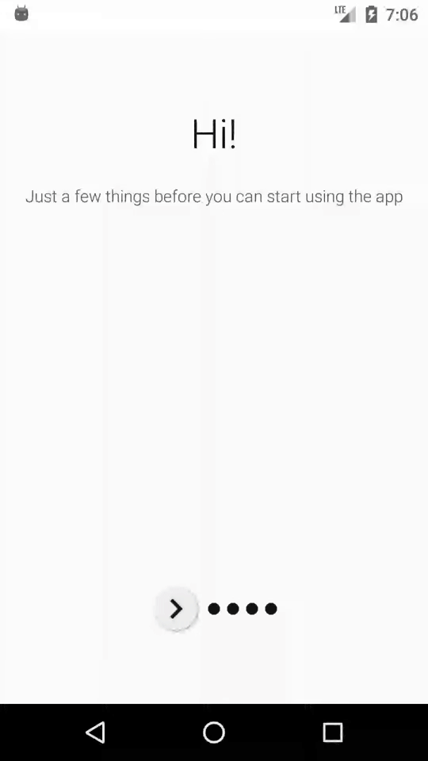

# CueDes

## Table of Content:
- [Description](#-description)
- [Tools Used](#%EF%B8%8F-tools-used)
- [Reflection](#%EF%B8%8F-reflection)
- [Installation](#%EF%B8%8F-installation)

### 📜 Description:
A simple Android App which rings an alarm when one is about to reach a destination.

A slight peek at the progress so far.

  
 
 

Note: The Video to GIF convertor made the GIF skip the video frames (look laggy). 
 

### 🛠️ Tools Used:
 - ViewBinding, LiveData, DataStore, Room, ViewModel, FragmentStateAdapter, Foreground and Bound Service, Property Animation Framework and Preference library.
 - Views: Motion, Constraint, Linear and Frame Layouts, ~~Spinner~~, RecyclerView, SearchView, ~~TabLayout~~ BottomNavigationView,  ViewPager2, SwitchCompatand OnBoardSupportFragment.
  - Google Maps SDK (FusedLocationProvider API, Geofencing API)
  - Timber
  - TSnackbar
  - Kotlin: Scope functions, Flow, Co-routines

### ✍️ [Reflection](/resources/reflection.md)

### 🔖 References:
- Learned a gradle way to hide API key from this [google codelab](https://codelabs.developers.google.com/codelabs/maps-platform-101-android#3).
- [Google Map ApiDemos repository](https://developers.google.com/maps/documentation/android-sdk/lite) by Google; Although some parts were obsolete, it gave me gotchas on the usage of the API alongside with `ViewGroup`s such as `RecyclerView`.
- ~~XML style for making `BottomSheetDialog` have rounded corners is adapted from this SO [answer](https://stackoverflow.com/a/50619479/11200630).~~
- ~~Prevented the dismissal of `BottomSheetDialogFragment` upon touching outside/pulling it down via this [method](https://stackoverflow.com/a/50734566/11200630).~~
- Used a Custom ViewPager2 Transition  via this [answer](https://stackoverflow.com/a/59235979/11200630). 
- ~~Expanding `BottomSheetDialogFragment` to a custom height was done with the help of this [answer](https://stackoverflow.com/a/58067230/11200630)~~
- The code for finding LatLng bounds of the area of interest from this [answer](https://stackoverflow.com/a/31029389/11200630) is used.
- The method of persisting a single instance of the repository w/o singleton pattern is based on this [codelab](https://developer.android.com/codelabs/android-room-with-a-view-kotlin#12).
- [Flaticon](flaticon.com) for a few awesome icons.

### ⚙️ Installation:
Note: It will be easier to do the following via a phone. 
1) Install the [APK](cuedes/app/build/outputs/apk/debug/app-debug.apk).
2) Allow App Installations from Unknown Sources, if requested.

